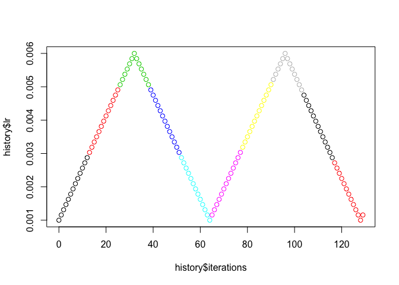

<!-- README.md is generated from README.Rmd. Please edit that file -->
<!-- badges: start -->

[](https://github.com/lorenzwalthert/KerasMisc/actions)
<!-- badges: end -->

[](https://www.tidyverse.org/lifecycle/#experimental)
[](https://travis-ci.org/lorenzwalthert/KerasMisc)
[](https://codecov.io/github/lorenzwalthert/KerasMisc?branch=master)

# KerasMisc

The goal of KerasMisc is to provide a collection of tools that enhance
the R implementation of Keras. Currently, the package features:

-   a Keras callback for cyclical learning rate scheduling as proposed
    by [Smith (2017)](https://arxiv.org/abs/1506.01186), closely adapted
    from the [Python implementation](https://github.com/bckenstler/CLR)
    and then extended so they the bands are scaled by a constant factor
    (typically &lt; 1) after the validation loss has not improved for a
    while. For details, see the
    [README](https://github.com/bckenstler/CLR) from the Python
    implementation and the example below for dynamically adjusting
    bandwidths.

Contributions welcome.

## Installation

You can install the development version of KerasMisc from GitHub with

``` r
remotes::install_github("lorenzwalthert/KerasMisc")
```

## Features

**Keras callbacks**

Let’s create a model

``` r
library(keras)
library(KerasMisc)
dataset <- dataset_boston_housing()
c(c(train_data, train_targets), c(test_data, test_targets)) %<-% dataset

mean <- apply(train_data, 2, mean)
std <- apply(train_data, 2, sd)
train_data <- scale(train_data, center = mean, scale = std)
test_data <- scale(test_data, center = mean, scale = std)


model <- keras_model_sequential() %>%
  layer_dense(
    units = 64, activation = "relu",
    input_shape = dim(train_data)[[2]]
  ) %>%
  layer_dense(units = 64, activation = "relu") %>%
  layer_dense(units = 1)
model %>% compile(
  optimizer = optimizer_rmsprop(lr = 0.001),
  loss = "mse",
  metrics = c("mae")
)
```

Next, we can fit the model with a learning rate schedule. We dynamically
adjust the bandwidths of the learnin rate (multiplication with 0.9)
whenever the validation loss does not decrease for three epochs. When
decreased, we wait 2 epochs (`cooldown`) before we set in the patience
counter again.

``` r
iter_per_epoch <- nrow(train_data) / 32
callback_clr <- new_callback_cyclical_learning_rate(
  step_size = iter_per_epoch * 2,
  base_lr = 0.001,
  max_lr = 0.006,
  mode = "triangular", 
  patience = 3, 
  factor = 0.9, 
  cooldown = 2,
  verbose = 0
)
model %>% fit(
  train_data, train_targets,
  validation_data = list(test_data, test_targets),
  epochs = 50, verbose = 0,
  callbacks = list(callback_clr)
)
```

We can now have a look at the learning rates:

``` r
head(callback_clr$history)
#>            lr base_lr max_lr iteration epochs
#> 1 0.001000000   0.001  0.006         0      1
#> 2 0.001198020   0.001  0.006         1      1
#> 3 0.001396040   0.001  0.006         2      1
#> 4 0.001594059   0.001  0.006         3      1
#> 5 0.001792079   0.001  0.006         4      1
#> 6 0.001990099   0.001  0.006         5      1
```

``` r
backend <- ifelse(rlang::is_installed("ggplot2"), "ggplot2", "base") 
plot_clr_history(callback_clr, granularity = "iteration", backend = backend)
```


